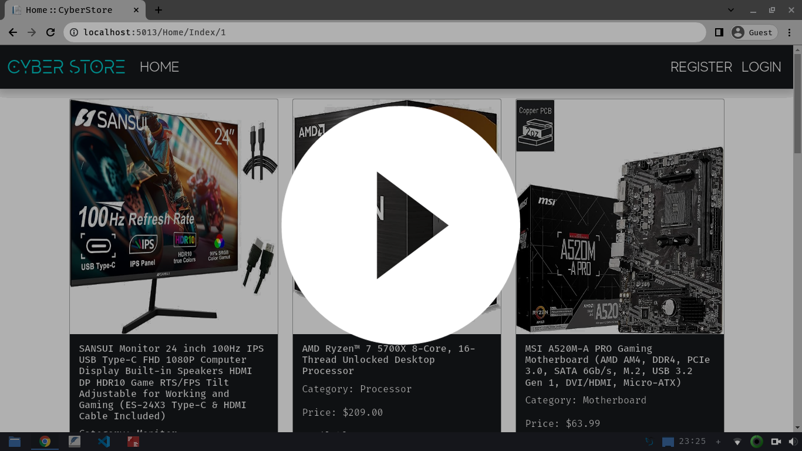

# CyberStore
An e-commerce web application focused on gaming products, developed using ASP.NET Core and adhering to the MVC architectural pattern.

## Requirements to Build and Run
- .NET SDK 7.0.111
- ASP.NET Core Runtime 7.0.11
- Clone the repository and run: `dotnet run`
- Open browser and goto: `http://localhost:5013/`

## The Different Roles Existing within the App
- Administrator Role:
	(You can find the credentials for the administrator account inside the `appsettings.json`)
	- This role has the ability to *create*, *update*, *delete* products and members' information, including their roles.
- Moderator Role:
	- This role has the ability to *create*, *update*, *delete* products.
- Member Role:
	- This role has the ability to *view* products and *add* them to their shoppping cart.
- Anonymous:
	- This role has the ability to *view* products.

## Features
Here's a  list of the key features integrated into my web application.

- [x] Authentication & Authorization System
- [x] User Management Dashboard
- [x] Product Management Dashboard
- [x] Home Page Product Display with Pagination
- [x] Shopping Cart and Checkout System

## Preview (YouTube)

### Tags:
C#, .NET 7.0, Entity Framework Core, SQLite
